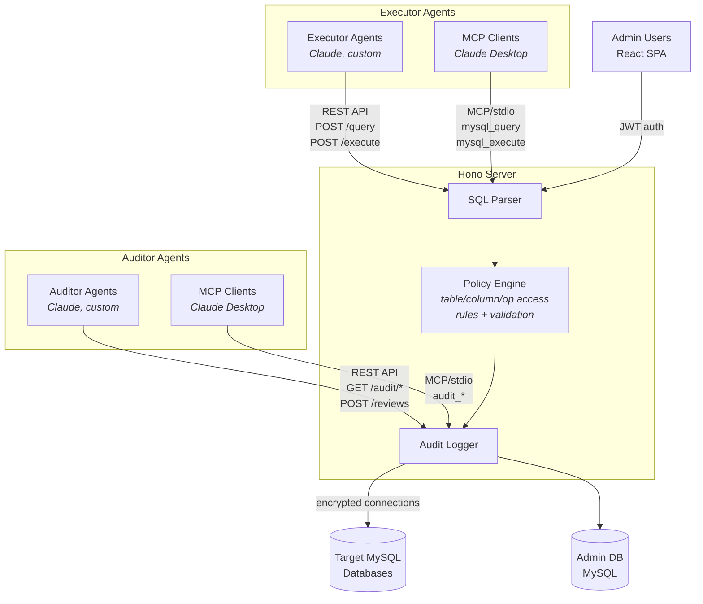

# Agent QueryGate

A security broker between AI agents and MySQL databases. Provides policy-based guardrails, audit logging, and a REST API with MCP wrapper so AI agents can query and modify MySQL safely.


---

## Features

- **Policy-based access control** -- default-deny with per-table, per-column, and per-operation rules
- **Audit logging** -- every query logged with before/after data diffs, optional agent-supplied reasoning
- **Audit review system** -- AI or human reviewers can flag audit entries with severity levels and notes
- **Agent roles** -- executor agents run queries, auditor agents review audit trails
- **MCP integration** -- Model Context Protocol server for Claude and other AI agents
- **REST API** -- standard HTTP endpoints any agent or client can use
- **Admin dashboard** -- React SPA with dark theme for managing users, databases, agents, and policies
- **Multi-tenant user management** -- superadmin / admin / user role hierarchy
- **Database credential encryption** -- AES-256-GCM encryption for stored credentials
- **SQL injection prevention** -- AST-based SQL parsing with blocked keyword detection
- **Row limit enforcement** -- policies can cap how many rows a write operation affects
- **WHERE clause requirements** -- force agents to include WHERE on UPDATE/DELETE
- **Value validation** -- per-column rules on write values (enum, regex pattern, min/max, not-null), checked before and after execution

---

## Quick Start

### Prerequisites

- Node.js 20+
- MySQL 8.0+

### Setup

```bash
# 1. Clone and install dependencies
git clone https://github.com/anthropics/agent-querygate.git
cd agent-querygate
npm install && cd frontend && npm install && cd ..

# 2. Configure environment
cp .env.example .env
# Edit .env -- set JWT_SECRET and ENCRYPTION_KEY to secure random values

# 3. Create the admin database
mysql -u root -e "CREATE DATABASE querygate_admin"

# 4. Run migrations
npm run db:migrate

# 5. Start the backend (port 3000)
npm run dev

# 6. In a separate terminal, start the frontend (port 5173)
npm run dev:frontend
```

Open **http://localhost:5173/setup** to create the initial superadmin account.

---

## Architecture



---

## Tech Stack

| Layer    | Technology                                           |
|----------|------------------------------------------------------|
| Backend  | Hono, Drizzle ORM, mysql2, node-sql-parser, Zod, JWT |
| Frontend | React 19, Vite 8, shadcn/ui, Tailwind CSS v4         |
| Auth     | bcryptjs (passwords), JWT (sessions), API keys       |
| MCP      | @modelcontextprotocol/sdk (stdio transport)          |
| Crypto   | Node crypto (AES-256-GCM)                            |
| Testing  | Vitest                                               |

---

## Project Structure

```
agent-querygate/
+-- src/
|   +-- index.ts                 # Hono server entry point
|   +-- config.ts                # Env config with Zod validation
|   +-- auth/
|   |   +-- api-key.ts           # API key generation and verification
|   |   +-- jwt.ts               # JWT token management
|   |   +-- middleware.ts         # Auth middleware (admin + agent)
|   |   +-- password.ts          # bcrypt password hashing
|   +-- db/
|   |   +-- schema.ts            # Drizzle ORM schema (users, agents, policies, audit)
|   |   +-- connection.ts        # Database connection factory
|   |   +-- migrate.ts           # Migration runner
|   +-- policy/
|   |   +-- engine.ts            # Policy evaluation (default-deny)
|   |   +-- sql-parser.ts        # AST-based SQL parsing
|   |   +-- blocked-keywords.ts  # Dangerous keyword detection
|   +-- query/
|   |   +-- executor.ts          # Read/write query execution
|   |   +-- pool-manager.ts      # Connection pool per target DB
|   |   +-- snapshot.ts          # Before/after data snapshots
|   +-- audit/
|   |   +-- logger.ts            # Audit log writer
|   +-- mcp/
|   |   +-- server.ts            # MCP server wrapping REST API
|   +-- routes/
|   |   +-- agent/               # Agent-facing endpoints (executor + auditor)
|   |   +-- admin/               # Admin dashboard endpoints
|   +-- lib/
|       +-- crypto.ts            # AES-256-GCM encrypt/decrypt
|       +-- errors.ts            # Typed error classes
|       +-- types.ts             # Shared type definitions
+-- frontend/                    # React SPA (shadcn/ui, dark theme)
+-- drizzle/                     # Generated migration SQL files
+-- tests/                       # Vitest unit tests
+-- drizzle.config.ts            # Drizzle Kit config
+-- vitest.config.ts             # Vitest config
```

---

## API Overview

### Agent API

All agent endpoints require an `X-API-Key` header.

**Executor agents** (query/mutate data):

| Method | Endpoint                       | Description                          |
|--------|--------------------------------|--------------------------------------|
| POST   | `/api/v1/query`                | Execute a read-only SELECT query     |
| POST   | `/api/v1/execute`              | Execute a write (INSERT/UPDATE/DELETE) |
| GET    | `/api/v1/tables`               | List tables the agent can access     |
| GET    | `/api/v1/tables/:name/schema`  | Describe a table's columns           |
| GET    | `/api/v1/health`               | Agent connection health check        |

**Auditor agents** (review audit trails):

| Method | Endpoint                       | Description                          |
|--------|--------------------------------|--------------------------------------|
| GET    | `/api/v1/audit/logs`           | Search and list audit logs           |
| GET    | `/api/v1/audit/logs/:id`       | Get audit log detail with reviews    |
| POST   | `/api/v1/audit/reviews`        | Flag an audit log entry              |
| GET    | `/api/v1/audit/reviews`        | List reviews created by this auditor |

### Admin API

All admin endpoints require a JWT `Authorization: Bearer <token>` header (except auth).

| Method | Endpoint                        | Description                         |
|--------|---------------------------------|-------------------------------------|
| POST   | `/admin/api/auth/setup`         | Create initial superadmin           |
| POST   | `/admin/api/auth/login`         | Authenticate and receive JWT        |
| GET    | `/admin/api/users`              | List users                          |
| POST   | `/admin/api/users`              | Create user (admin+ only)          |
| GET    | `/admin/api/databases`          | List registered databases           |
| POST   | `/admin/api/databases`          | Register a target database          |
| GET    | `/admin/api/agents`             | List agents                         |
| POST   | `/admin/api/agents`             | Create agent with role (returns API key) |
| GET    | `/admin/api/agents/:id/policies`| List policies for an agent          |
| POST   | `/admin/api/agents/:id/policies`| Create access policy                |
| GET    | `/admin/api/audit`              | Query audit logs                    |
| GET    | `/admin/api/audit/:id/reviews`  | List reviews for an audit log       |
| POST   | `/admin/api/audit/:id/reviews`  | Create a review on an audit log     |
| GET    | `/admin/api/dashboard`          | Dashboard statistics                |

---

## MCP Tools

The MCP server wraps the REST API for use with Claude Desktop and other MCP-compatible clients. It connects via stdio transport. Tools registered depend on the agent role.

**Executor tools** (default):

| Tool                   | Description                                      |
|------------------------|--------------------------------------------------|
| `mysql_query`          | Execute a read-only SQL SELECT query             |
| `mysql_execute`        | Execute a write SQL statement (INSERT/UPDATE/DELETE) |
| `mysql_list_tables`    | List all tables the agent has access to           |
| `mysql_describe_table` | Get column schema for a specific table            |
| `mysql_health`         | Check agent connection health status              |

**Auditor tools** (when `AQG_AGENT_ROLE=auditor`):

| Tool                   | Description                                      |
|------------------------|--------------------------------------------------|
| `audit_list_logs`      | Search and list audit logs with filters           |
| `audit_get_log`        | Get a single audit log with its reviews           |
| `audit_create_review`  | Flag an audit log entry with severity and notes   |
| `audit_list_reviews`   | List reviews created by this auditor              |
| `mysql_health`         | Check agent connection health status              |

### Claude Desktop Configuration

Add to your `claude_desktop_config.json`:

```json
{
	"mcpServers": {
		"agent-querygate": {
			"command": "node",
			"args": ["path/to/agent-querygate/dist/mcp/server.js"],
			"env": {
				"AQG_BASE_URL": "http://localhost:3000",
				"AQG_API_KEY": "your-agent-api-key",
				"AQG_AGENT_ROLE": "executor"
			}
		}
	}
}
```

Set `AQG_AGENT_ROLE` to `auditor` for an auditor agent's MCP server.

---

## Documentation

| Guide                                          | Description                                 |
|------------------------------------------------|---------------------------------------------|
| [Getting Started](docs/getting-started.md)     | First-time setup walkthrough                |
| [API Reference](docs/api-reference.md)         | Complete endpoint documentation             |
| [MCP Integration](docs/mcp-integration.md)     | Connecting AI agents via MCP                |
| [Admin Guide](docs/admin-guide.md)             | Managing users, databases, and policies     |
| [Security](docs/security.md)                   | Encryption, auth, and threat model          |
| [Architecture](docs/architecture.md)           | System design and data flow                 |
| [Development](docs/development.md)             | Contributing and local development          |

---

## Environment Variables

| Variable           | Description                            | Default                |
|--------------------|----------------------------------------|------------------------|
| `ADMIN_DB_HOST`    | Admin database host                    | `localhost`            |
| `ADMIN_DB_PORT`    | Admin database port                    | `3306`                 |
| `ADMIN_DB_NAME`    | Admin database name                    | `querygate_admin`  |
| `ADMIN_DB_USER`    | Admin database user                    | `root`                 |
| `ADMIN_DB_PASSWORD`| Admin database password                | (empty)                |
| `JWT_SECRET`       | Secret for signing JWTs (min 16 chars) | **required**           |
| `ENCRYPTION_KEY`   | AES-256 key for DB passwords (min 32)  | **required**           |
| `PORT`             | Server listen port                     | `3000`                 |
| `NODE_ENV`         | Environment mode                       | `development`          |

---

## Scripts

| Script              | Command              | Description                              |
|---------------------|-----------------------|------------------------------------------|
| `npm run dev`       | `tsx watch src/index.ts` | Start backend in dev mode with hot reload |
| `npm run dev:frontend` | `cd frontend && npm run dev` | Start frontend dev server (Vite)    |
| `npm run build`     | `tsc + vite build`   | Build backend and frontend for production |
| `npm run start`     | `node dist/index.js` | Run production build                     |
| `npm run test`      | `vitest run`         | Run test suite                           |
| `npm run test:watch`| `vitest`             | Run tests in watch mode                  |
| `npm run db:generate`| `drizzle-kit generate` | Generate migration files from schema   |
| `npm run db:migrate`| `tsx src/db/migrate.ts` | Apply pending migrations               |
| `npm run db:studio` | `drizzle-kit studio` | Open Drizzle Studio GUI                  |

---

## License

MIT
